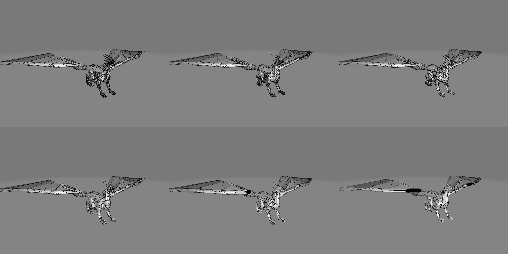

# Simplifier
3D mesh simplification application

Implementation of
[Surface Simplification Using Quadric Error Metrics, SIGGRAPH 97](http://cseweb.ucsd.edu/~ravir/190/2016/garland97.pdf),
written in C++, inspired by [fogleman's simplify](https://github.com/fogleman/simplify).



<p align="center">Iteratively simplifying a  <a href="https://free3d.com/3d-model/black-dragon-rigged-and-game-ready-92023.html" >complex model </a> by 50%</p>

__Faces after each iteration__
|     |     |    |
|-----|-----|----|
|37986|18993|9496|
| 4747| 2373|1186|


`Output for the simplification above:`
```yaml
D:\Dev\git\Simplifier>D:/Dev/git/Simplifier/build/release/simplifier mode=iterative iterations=5  in=d:\Downloads\39-stl\stl\Dragon.stl
Loading "d:\\Downloads\\39-stl\\stl\\Dragon.stl"
Input mesh contains 37986 faces
Simplifying...
Iteration 1 | 18993 faces | duration: 341 ms
Iteration 2 | 9496 faces | duration: 149 ms
Iteration 3 | 4747 faces | duration: 63 ms
Iteration 4 | 2373 faces | duration: 31 ms
Iteration 5 | 1186 faces | duration: 13 ms
```
---

### Install

1. **Clone the repository**:
    ```sh
    git clone <repository-url>
    cd Simplifier
    ```

2. **Create a build directory**:
    ```sh
    mkdir build
    cd build
    ```

3. **Run CMake to configure the project**:
    ```sh
    cmake ..
    ```

4. **Build the project**:
    ```sh
    cmake --build .
    ```

### Usage

#### example
- `Simplifier.exe factor=0.1 in=input.stl out=output.stl`
- `Simplifier.exe in=D:\Downloads\Dragon.stl mode=iterative iterations=5`
#### params
- `in`: input file path
- `out`: output file path             [optional, default=input_simplified<iteration>.stl]    
- `factor`: 0.01-0.99                 [optional, default=0.5]
- `mode`: simple|iterative            [optional, default=simple]
- `iterations`: number of iterations  [optional, default=1] (only for iterative mode)        

---
